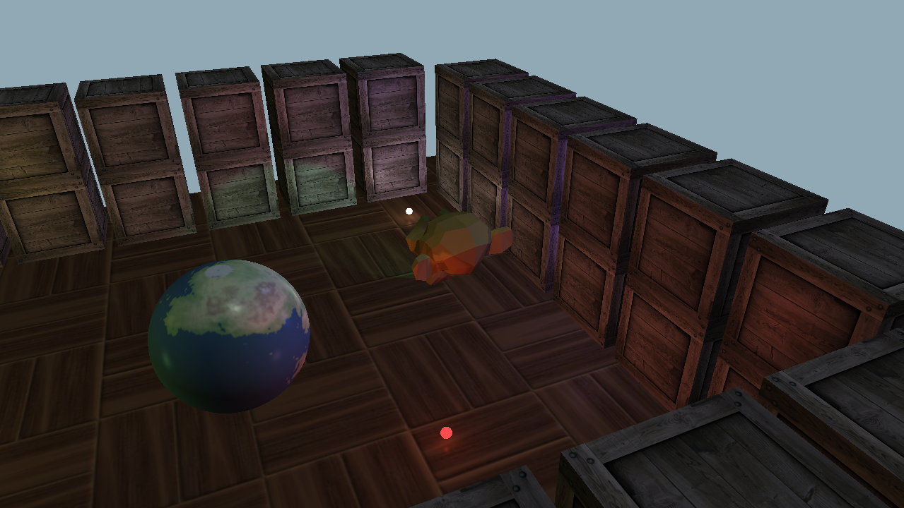

# 3D graphics course final project

## Installation

- Python 3.8
- `pip install -r requirements.txt`

## Usage

- `python main.py`

## Used libraries:

- `glfw` - Window creation
- `pyopengl` - OpenGL bindings
- `pyrr` + `numpy` - Vector and matrix operations
- `pillow` - Image loading
- `pywavefront` - Handling of `*.obj` and `*.mtl` files

## Keyboard shortcuts

### Camera

- `1` - Static camera
- `2` - Follow the monkey
- `3` - *Be* the monkey
  
### Shading options

- `O` - Gouraud shading
- `P` - Phong shading
- `F` - Toggle fog
- `<- / ->` - Change spotlight direction
